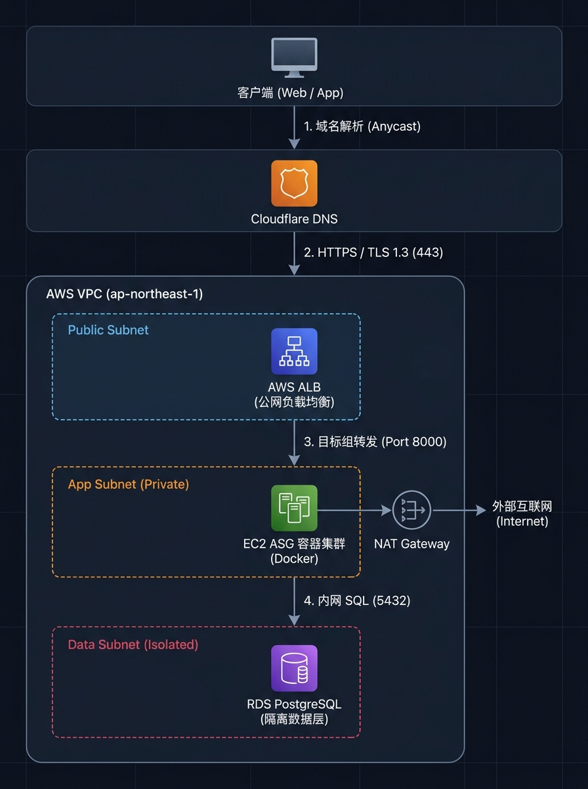

# Hetu Infra

基于 **Terragrunt + Terraform** 构建的生产级云原生基础设施（AWS 东京区 `ap-northeast-1` + Cloudflare）。

项目遵循**纵深防御（Defense-in-Depth）**、**零信任网络隔离**与**无静态秘钥**的设计原则，面向高可用与低运维成本的流媒体及后端业务。

---

## 一、系统架构与流量图

### 1. 端到端流量流向图



#### 流量链路说明：
- **入向业务流（实线）**：客户端通过 Cloudflare 获得 Anycast 极速解析 -> 请求直达 AWS ALB（终结 TLS 1.3，80 自动跳转 443）-> 转发至私有子网 EC2 容器服务 -> 容器通过内网安全读写隔离的 RDS PostgreSQL（5432 端口）。
- **出向依赖流（虚线）**：私有子网主机与容器无公网 IP，所有镜像拉取及第三方 API 调用通过同可用区的 NAT Gateway 进行 SNAT 统一出网。

---

## 二、三层网络与安全隔离

严格遵循最小权限暴露原则，划分三层物理隔离子网：

| 子网层级 | 网络属性 | 部署服务 | 访问控制规则 |
| :--- | :--- | :--- | :--- |
| **Public Tier** | 拥有公网 IP，挂载 IGW | ALB、NAT Gateway | 仅放行公网 HTTP(80) / HTTPS(443) 入向；HTTP 自动 301 重定向 |
| **App Tier** | **无公网 IP**，私有子网 | EC2 ASG 容器集群 | **仅允许来自 ALB 安全组**的入向流量；通过 NAT Gateway 出网 |
| **Data Tier** | **完全隔离**（无外网路由）| RDS PostgreSQL | **仅允许来自 App 安全组**的 5432 端口；物理阻断外网出入 |

- **防 SSRF 提权**：EC2 全面强制启用 **IMDSv2**（`http_tokens = "required"`）。

---

## 三、技术考量

### 1. 零长期秘钥与安全闭环
- **GitHub Actions OIDC 互联**：通过 AWS STS 动态获取短期 Token，代码库彻底告别静态 Access Key / Secret Key。
- **免开放 22 端口（No Bastion）**：全面采用 **AWS Systems Manager (SSM)** 替代传统 SSH 堡垒机，操作全程受 CloudTrail 审计。
- **凭据自动化轮换**：RDS 密码由 **Secrets Manager** 托管，配置定期自动触发轮换。

### 2. 算力与网络成本优化 (FinOps)
- **AWS Graviton (ARM64)**：计算节点统一采用 ARM64 架构与 Amazon Linux 2023，相比 x86 降低约 **20%~30%** 算力成本。
- **同 AZ 就近 NAT 路由**：通过路由表将每个 AZ 的私有子网直连本 AZ 的 NAT Gateway，消除跨可用区数据传输费（Cross-AZ Data Transfer Fee）。

### 3. 弹性容灾与平滑更新
- **高可用跨区部署**：网络、ALB 与计算节点跨双可用区（AZ-a / AZ-c）高可用分布。
- **零停机滚动替换**：ASG 配置 `instance_refresh` 策略与 300 秒容器预热保护，实例逐台轮换，发布过程业务无感知。

### 4. Terragrunt 工程化规范
- **DRY 状态管理**：根目录统一管理 S3 Remote State 与 Lockfile，消除子模块样板代码。
- **Mock 解耦**：各模块声明 `mock_outputs`，上游模块未部署时依然可进行独立的 `plan` 与静态检查。

---

## 四、代码目录结构

```text
├── modules/               # 可复用的 Terraform 底层模块
│   ├── aws/
│   │   ├── network/       # 3-Tier VPC、子网与安全组
│   │   ├── alb/           # Application Load Balancer
│   │   ├── compute/       # EC2 Launch Template & ASG
│   │   ├── database/      # RDS PostgreSQL & Secrets 轮换
│   │   └── iam/           # GitHub OIDC 与 SSM 角色
│   └── cloudflare/
│       └── dns/           # Cloudflare 域名记录管理
└── stacks/                # Terragrunt 环境部署编排与输入配置
    ├── root.hcl           # 全局 Backend 与 S3 Lock 继承
    ├── aws/               # 各 AWS 资源栈
    └── cloudflare/        # Cloudflare 资源栈
```